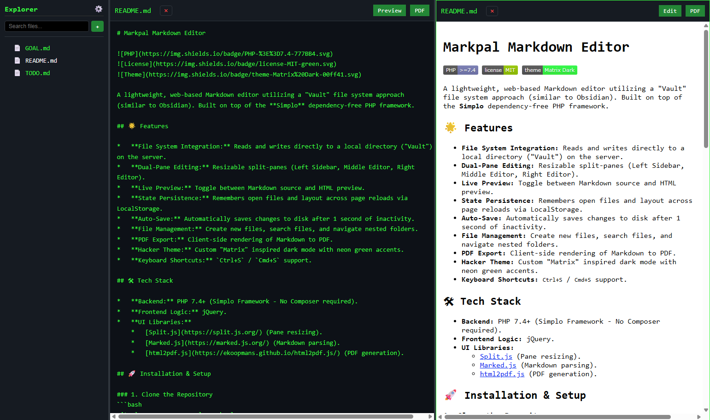

# Markpal Markdown Editor


A lightweight, web-based Markdown editor utilizing a "Vault" file system approach (similar to Obsidian). Built on top of the **Simplo** dependency-free PHP framework.

## Screenshot



## 🌟 Features

*   **File System Integration:** Reads and writes directly to a local directory ("Vault") on the server.
*   **Dual-Pane Editing:** Resizable split-panes (Left Sidebar, Middle Editor, Right Editor).
*   **Live Preview:** Toggle between Markdown source and HTML preview.
*   **State Persistence:** Remembers open files and layout across page reloads via LocalStorage.
*   **Auto-Save:** Automatically saves changes to disk after 1 second of inactivity.
*   **File Management:** Create new files, search files, and navigate nested folders.
*   **PDF Export:** Client-side rendering of Markdown to PDF.
*   **Hacker Theme:** Custom "Matrix" inspired dark mode with neon green accents.
*   **Keyboard Shortcuts:** `Ctrl+S` / `Cmd+S` support.

## 🛠 Tech Stack

*   **Backend:** PHP 7.4+ (Simplo Framework - No Composer required).
*   **Frontend Logic:** jQuery.
*   **UI Libraries:** 
    *   [Split.js](https://split.js.org/) (Pane resizing).
    *   [Marked.js](https://marked.js.org/) (Markdown parsing).
    *   [html2pdf.js](https://ekoopmans.github.io/html2pdf.js/) (PDF generation).

## 🚀 Installation & Setup

### 1. Clone the Repository
```bash
git clone <your-repo-url> markpal
cd markpal
```

### 2. Server Requirements
*   PHP 7.4 or higher.
*   Apache (with `mod_rewrite` enabled) or Nginx.
*   **Write Permissions:** The web server user (e.g., `www-data` or `apache`) must have **write access** to the folder you intend to use as your Vault.

### 3. Create a Vault Folder
Create a directory anywhere on your system that PHP can access.
```bash
mkdir /var/www/my-notes
chown www-data:www-data /var/www/my-notes
chmod 755 /var/www/my-notes
```

### 4. Configure Web Server
Point your virtual host document root to the `markpal` directory.

**Apache Example (.htaccess is included):**
Ensure `AllowOverride All` is set in your Apache config to allow the `.htaccess` file to handle routing.

### 5. First Run
1.  Open the application in your browser (e.g., `http://localhost`).
2.  You will be prompted to enter the **Absolute Path** to your Vault folder (e.g., `/var/www/my-notes`).
3.  Click "Set Path".

## 📂 Project Structure

This project extends the base Simplo structure. Here are the key files for the Editor:

```text
markpal/
├── app/
│   ├── controllers/
│   │   └── EditorController.php  # Handles File I/O, Tree generation, Sanitization
│   └── views/
│       └── editor.php            # Main single-page application view
├── assets/
│   ├── css/
│   │   └── editor.css            # Matrix theme and Split.js layout
│   └── js/
│       └── editor.js             # Client-side logic (State, Auto-save, UI)
├── config/
│   └── routes.php                # Defined API endpoints (/api/read, /api/save, etc.)
└── index.php                     # Entry point
```

## 🔒 Security Implications

**⚠️ Important:** This application gives direct filesystem read/write access to the configured Vault directory.

1.  **Local Use:** It is recommended to run this tool locally or behind a VPN/Basic Auth.
2.  **Sanitization:** The `EditorController` implements strict path sanitization:
    *   Prevents Directory Traversal (`../`).
    *   Strips Null Bytes.
    *   Restricts file creation to alphanumeric names.
    *   Restricts extensions to `.md` and `.txt`.
3.  **Deployment:** **DO NOT** deploy this to a public-facing server without adding an authentication layer (e.g., htpasswd or implementing a Login Controller), otherwise, anyone can overwrite your files.

## ⌨️ Keyboard Shortcuts

| Shortcut | Action |
| :--- | :--- |
| `Ctrl + S` | Force Save current file |
| `Cmd + S` | Force Save current file (Mac) |

## 🤝 Contributing

1.  Fork the repository.
2.  Create your feature branch (`git checkout -b feature/AmazingFeature`).
3.  Commit your changes (`git commit -m 'Add some AmazingFeature'`).
4.  Push to the branch (`git push origin feature/AmazingFeature`).
5.  Open a Pull Request.

## 📄 License

Distributed under the MIT License. See `LICENSE` for more information.